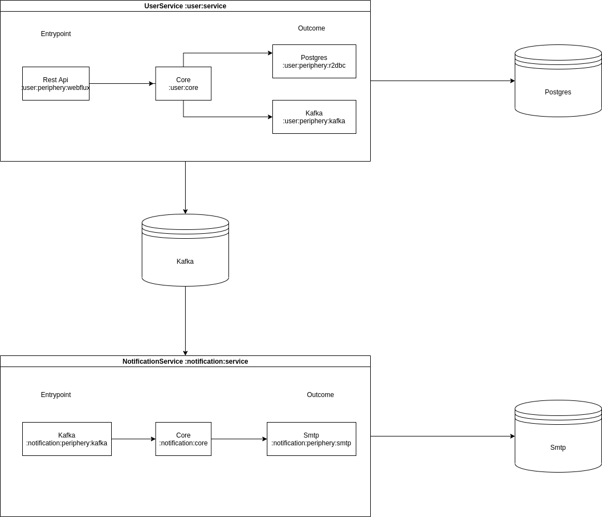

## The purpose
#### Test for Java Developer
As a software engineer, I would like to implement microservices based backend APIs to
register/edit/read/(soft) delete multiple users via bulk operations
##### Key requirements
1. The applications should be written in spring-boot, Java or other JVM languages
2. The applications will be packaged via docker and can run in a multi-container way via
docker-compose.yml. Please provide details of how to run your application in a
README file
3. Upon successful registration, send out a welcome email (you could use fake smtp
server)
4. Proper validation, error handling and testing.
5. Two separate microservices user-service and notification-service
6. Communication between services can either be synchronous or asynchronous

##### Additional Requirements
1. REST API documentation (Compulsory for senior position application)
2. Partial handling (Optional)

## Prerequisities
* docker-compose 3.7 or newer
* Java 11 or newer

## Run
#### Build
```
./gradlew clean build bootBuildImage
```
#### Start docker
```
docker-compose up --build -d
```
#### Run integration tests
```
cd integration-test

./gradlew clean build
```

#### Check documentation
```
http://localhost:8080/swagger-ui/index.html#
```

## Code
#### Components



